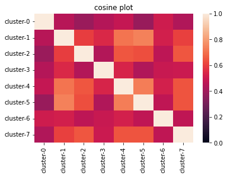

☀️ Cluster Centroid Heat Maps
=============================

In order to better interpret your clusters, you may need to visualise
them using heatmaps. These heatmaps allow users to see which clusters
are the closest.

.. code:: ipython3

    In [1]: %load_ext autoreload
    In [2]: %autoreload 2

Installation
------------

.. code:: ipython3

    !pip install -q jsonshower

.. code:: ipython3

    from relevanceai import Client

.. code:: ipython3

    client = Client()

You can retrieve the ecommerce dataset from
https://relevanceai.readthedocs.io/en/development/core/available_datasets.html#relevanceai.utils.datasets.get_ecommerce_1_dataset.

.. code:: ipython3

    ds = client.Dataset("ecommerce")

Centroid Heatmap
----------------

.. code:: ipython3

    from relevanceai.operations.viz.cluster import ClusterVizOps
    cluster_ops = ClusterVizOps.from_dataset(ds, alias="main-cluster", vector_fields=["product_image_clip_vector_"])

.. code:: ipython3

    cluster_ops.centroid_heatmap()

.. parsed-literal::

    Your closest centroids are:
    0.74 cluster-5, cluster-1
    0.73 cluster-5, cluster-4
    0.71 cluster-4, cluster-1
    0.65 cluster-4, cluster-2
    0.65 cluster-7, cluster-2
    0.64 cluster-7, cluster-4
    0.64 cluster-7, cluster-5
    0.63 cluster-5, cluster-2

.. parsed-literal::

    [Text(0.5, 1.0, 'cosine plot')]

Now we can see if our clusters are useful when we check the dashboard
and inspect those clusters:

.. code:: ipython3

    closest = cluster_ops.closest()['results']

.. parsed-literal::

    You can now visit the dashboard at https://cloud.relevance.ai/sdk/cluster/centroids/closest

Below, we can now see if 2 separate clusters. One for boots and one for
shoes and if we need that granularity.

.. code:: ipython3

    cluster_ops.show_closest(cluster_ids=['cluster-1', 'cluster-5'], image_fields=['product_image'])

.. parsed-literal::

    You can now visit the dashboard at https://cloud.relevance.ai/sdk/cluster/centroids/closest

.. raw:: html

    <table border="1" class="dataframe">
      <thead>
        <tr style="text-align: right;">
          <th></th>
          <th>product_image</th>
          <th>cluster_id</th>
          <th>_id</th>
        </tr>
      </thead>
      <tbody>
        <tr>
          <th>0</th>
          <td></td>
          <td>cluster-1</td>
          <td>931f907b-13f1-41e5-92fe-c8007cdedada</td>
        </tr>
        <tr>
          <th>1</th>
          <td></td>
          <td>cluster-1</td>
          <td>93734870-b304-4426-9cd4-d906fea340b8</td>
        </tr>
        <tr>
          <th>2</th>
          <td></td>
          <td>cluster-1</td>
          <td>6416c33d-3287-446c-90d3-ea220bf6312b</td>
        </tr>
        <tr>
          <th>3</th>
          <td></td>
          <td>cluster-5</td>
          <td>8f5dfc61-6fd1-422e-9682-7df039b8c099</td>
        </tr>
        <tr>
          <th>4</th>
          <td></td>
          <td>cluster-5</td>
          <td>65082728-720b-4604-8ee4-f7d0ecab0e7f</td>
        </tr>
        <tr>
          <th>5</th>
          <td></td>
          <td>cluster-5</td>
          <td>7ace5350-1487-44d3-9840-2b89183f3117</td>
        </tr>
      </tbody>
    </table>

