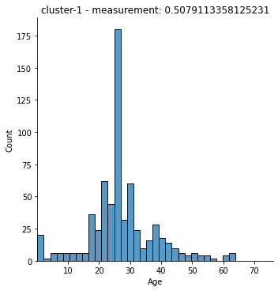
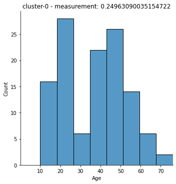

👓 Cluster Analysis
==================

Plotting Cluster Distributions
------------------------------

.. code:: ipython3

    # remove `!` if running the line in a terminal
    !pip install -U RelevanceAI[notebook]==2.0.0

.. code:: ipython3

    from relevanceai import Client
    
    """
    You can sign up/login and find your credentials here: https://cloud.relevance.ai/sdk/api
    Once you have signed up, click on the value under `Activation token` and paste it here
    """
    client = Client()
    

.. code:: ipython3

    from relevanceai.utils.datasets import get_titanic_dataset
    
    documents = get_titanic_dataset()
    for i,doc in enumerate(documents):
      doc['_id']=i
    

.. code:: ipython3

    ds = client.Dataset("titanic")
    ds.insert_documents(documents)

Clustering
----------

.. code:: ipython3

    from sklearn.cluster import KMeans
    
    VECTOR_FIELD = "value_vector_"
    KMEAN_NUMBER_OF_CLUSTERS = 5
    ALIAS = "kmeans_" + str(KMEAN_NUMBER_OF_CLUSTERS)
    
    model = KMeans(n_clusters=KMEAN_NUMBER_OF_CLUSTERS)
    clusterer = client.ClusterOps(alias=ALIAS, model=model)
    clusterer.operate(dataset_id="titanic", vector_fields=["value_vector_"])
    
    

Plot Basic Distributions
------------------------

.. code:: ipython3

    viz_ops = client.ClusterVizOps(
        dataset_id="titanic",
        vector_fields=["value_vector_"],
        alias="kmeans_5"
    )

.. code:: ipython3

    viz_ops.plot_distributions("Age", top_indices=3)

.. image:: cluster_distribution_guide_files/cluster_distribution_guide_9_0.png

.. image:: cluster_distribution_guide_files/cluster_distribution_guide_9_1.png

.. image:: cluster_distribution_guide_files/cluster_distribution_guide_9_2.png

Plotting Custom Distributions - Variation
-----------------------------------------

.. code:: ipython3

    from scipy.stats import skew, variation
    
    
    viz_ops.plot_distributions(
        numeric_field="Age", dataset_id="titanic", measure_function=variation, top_indices=3
    )

.. parsed-literal::

      0%|          | 0/5 [00:00<?, ?it/s]

.. image:: cluster_distribution_guide_files/cluster_distribution_guide_11_1.png

.. image:: cluster_distribution_guide_files/cluster_distribution_guide_11_2.png

.. image:: cluster_distribution_guide_files/cluster_distribution_guide_11_3.png

.. code:: ipython3

    
    viz_ops.plot_distributions(
        numeric_field="Age", dataset_id="titanic", measure_function=skew, top_indices=2
    )

.. parsed-literal::

      0%|          | 0/5 [00:00<?, ?it/s]

