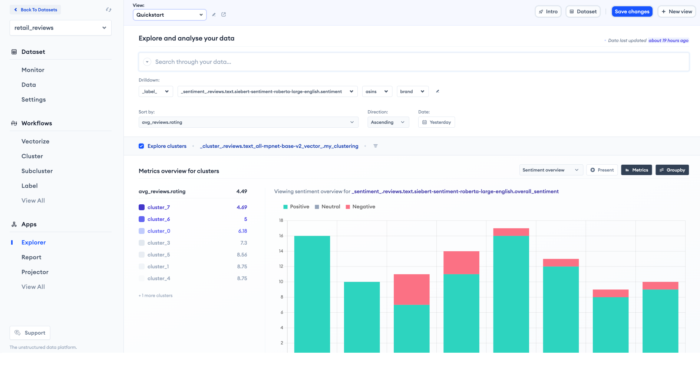
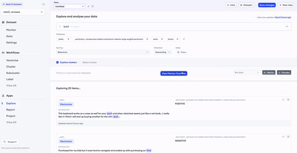

🏃‍♀️ Relevance AI for analyzing unstructured data
===============================================

Use `Relevance AI <https://cloud.relevance.ai/>`__ for clustering and
gaining meaning from your unstructured data.

✨ Example
----------

An example cluster app that showcases meaning amongst each group of
unstructured data With just a few lines of code, you’ll get rich,
interactive, shareable dashboards

   image.png

🔒 Data & Privacy
~~~~~~~~~~~~~~~~~

We take security very seriously, and our cloud-hosted dashboard uses
industry standard best practices for encryption. Our team adhere to our
`strict privacy policy <https://relevance.ai/data-security-policy/>`__.

--------------

🪄 Install ``RelevanceAI`` library and authenticate the client
~~~~~~~~~~~~~~~~~~~~~~~~~~~~~~~~~~~~~~~~~~~~~~~~~~~~~~~~~~~~~~

Start by installing the library and logging in to your account.

.. code:: ipython3

    !pip install RelevanceAI -qqq

.. code:: ipython3

    In [1]: %load_ext autoreload

    In [2]: %autoreload 2

.. code:: ipython3

    from relevanceai import Client

    # Instantiate the client and authenticate
    client = Client()

    # This will prompt a link to collect your API token which includes your project and API key

📩 Upload Some Data
~~~~~~~~~~~~~~~~~~~

1️⃣. Open a new **Dataset**

2️⃣. **Insert** some documents

.. code:: ipython3

    from relevanceai.utils import example_documents

    documents = example_documents("retail_reviews_small", number_of_documents=100)

.. code:: ipython3

    dataset_id = "retail_reviews"
    # The dataset name that we have decided, this can be whatever you want for your own data
    dataset = client.Dataset(dataset_id=dataset_id)
    # Instantiate the dataset

.. code:: ipython3

    dataset.insert_documents(documents)

.. parsed-literal::

    while inserting, you can visit monitor the dataset at https://cloud.relevance.ai/dataset/retail_reviews/dashboard/monitor/
    ✅ All documents inserted/edited successfully.

You can view your dataset quickly using ``dataset.head`` just like in
Pandas!

.. code:: ipython3

    # dataset.head()

👨‍🔬 Vectorizing And Bringing AI In
---------------------------------

💪 In order to better visualise clusters within our data, we must
vectorise the unstructured fields in a our clusters. In this dataset,
there are two important text fields, both located in the review body;
These are the ``reviews.text`` and ``reviews.title``. For the purposes
of this tutorial, we will be vectorizing ``reviews.text`` only.

🤔 Choosing a Vectorizer
~~~~~~~~~~~~~~~~~~~~~~~~

An important part of vectorizing text is around choosing which
vectorizer to use. Relevance AI allows for a custom vectorizer from
vectorhub, but if you can’t decide, the default models for each type of
unstructured data are listed below.

-  Text: ``SentenceTransformers``
-  Images: ``CLIP``

.. code:: ipython3

    # !pip install -q sentence-transformers

🤩 Vectorize in one line
~~~~~~~~~~~~~~~~~~~~~~~~

We support vectorizing text in just 1 line.

.. code:: ipython3

    # The text fields here are the ones we wish to construct vector representations for
    text_fields = ["reviews.text"]
    dataset.vectorize_text(fields=text_fields)

Search Application
------------------

You can also build a search application in just 1 line of code.

This search application can be built by using

.. code:: ipython3

    dataset.launch_search_app()

.. parsed-literal::

    https://cloud.relevance.ai/dataset/retail_reviews/deploy/recent/search

You can view an example of our text search below.

   Text Search

✨ Cluster
----------

In one line of code, we can create a cluster application based on our
new vector field. This application is how we will discover insights
about the semantic groups in our data.

First, let us see what vector fields are availbale in the dataset.

.. code:: ipython3

    dataset.list_vector_fields()

.. parsed-literal::

    ['reviews.text_all-mpnet-base-v2_vector_']

.. code:: ipython3

    model = "kmeans"
    number_of_clusters = 20
    alias = "my_clustering"
    vector_fields = dataset.list_vector_fields()
    dataset.cluster(vector_fields=vector_fields, model=model, alias=alias)

🔗 The above step will produce a link to your first cluster app!
~~~~~~~~~~~~~~~~~~~~~~~~~~~~~~~~~~~~~~~~~~~~~~~~~~~~~~~~~~~~~~~~

Click the link provided to view your newly generated clusters in a
dashboard app.

🤔 Choosing the Number of Clusters
----------------------------------

Most clustering algorithms require you choose the number clusters you
wish to find. This can be tricky if you don’t know what the expect.
Luckily, RelevanceAI uses a clustering algorithm called community
detection that does not require the number of clusters to be set.
Instead, the algorithm will decide how many is right for you. To
discover more about other clustering methods, read more in Cluster
Report.

🏷️ Add Labels To Your Dataset
-----------------------------

Labelling refers to when you apply a vector search from one tag to
another.

.. code:: ipython3

    labels = [{"label": "Furniture", "label": "Home office", "label": "Electronics"}]

.. code:: ipython3

    label_dataset.insert_documents(labels)

.. parsed-literal::

    while inserting, you can visit monitor the dataset at https://cloud.relevance.ai/dataset/retail-label/dashboard/monitor/
    ✅ All documents inserted/edited successfully.

.. code:: ipython3

    # Vectorize like you would with a normal dataset
    label_dataset.vectorize_text(
        fields=['label'],
        output_fields=["label_vector_"]
    )

.. code:: ipython3

    dataset.label_from_dataset(
        vector_fields=dataset.list_vector_fields(),
        label_dataset=label_dataset
    )

You can now see the labels on your dataset on Relevance AI.

.. figure:: attachment:image.png
   :alt: image.png

   image.png

🌹 Extract Sentiment
--------------------

You can add sentiment to your dataset. After adding sentiment

.. code:: ipython3

    dataset.extract_sentiment(text_fields=["reviews.text"]

Want to quickly create some example applications with Relevance AI?
Check out some other guides below! - `Text-to-image search with OpenAI’s
CLIP <https://docs.relevance.ai/docs/quickstart-text-to-image-search>`__
- `Hybrid Text search with Universal Sentence Encoder using
Vectorhub <https://docs.relevance.ai/docs/quickstart-text-search>`__ -
`Text search with Universal Sentence Encoder Question Answer from
Google <https://docs.relevance.ai/docs/quickstart-question-answering>`__
