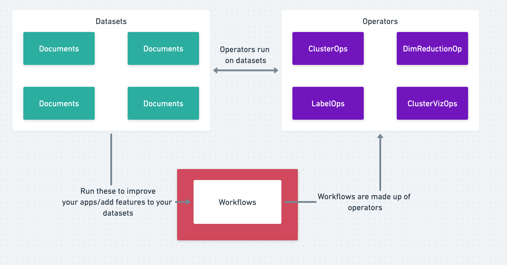

.. Relevance AI documentation master file, created by
   sphinx-quickstart on Mon Nov  8 16:54:12 2021.
   You can adapt this file completely to your liking, but it should at least
   contain the root `toctree` directive.

Welcome to Relevance AI's documentation!
========================================

Relevance AI Concepts
---------------------------

📄 **Documents** refer to JSONs/Python dictionaries that contain metadata and vectors.

🎺 **Datasets** refer to documents that are stored online in Relevance AI.

🧑‍🔬 **Workflows** allow users to add new features/perform useful operations (e.g. - vectorizing and clustering text data). They are made up of many operators.

⚡ **Vectorizers** refer to machine learning models that can turn data into vectors (e.g. Word2vec turns words into vectors).

🚡 **Operators** are the building blocks used to provide users the ability to add something new.

About Relevance AI
--------------------

Relevance AI is an end-to-end platform for unstructured data using vector embeddings.

It makes it easy for data teams to connect to data, analyze it with vectors and share it in as an interactive app or production api.

The platform has 3 core elements:

1. **Python Library**, to extract vectors from unstructured and apply algorithms on top of it such as clustering, nearest neighbors, etc. Integrates well with common data science libraries such as huggingface, pandas, sklearn and more. The python library also serves as a sdk to the API.

2. **API/Infrastructure**, to store, query and analyze data and its associated vectors into a data warehouse + vector database. Integrates well with existing data warehouses (Snowflake, Bigquery, ..) and vector databases (FAISS, HNSWLib, Elasticsearch, ..)

3. **App Builder**, a no-code dashboard that allows you to quickly build and share visualizations, interactive applications and reports designed for machine learning and unstructured data.

Why Relevance AI
--------------------
- **Managed end-to-end**, Relevance AI's platform is end-to-end managed that helps you go from data to value. E.g. text, image -> Vectorizing -> Inserting into managed or self deployed vector databases & data warehouses -> Different ML algorithms K-NN, ANN, Cluster, DR -> Shareable Frontend App and API that interacts and enhances the process.
- **Highly flexible and integrated**. Each part of the platform you can bring your own models. (e.g. Replacing the default clustering algorithm with any sklearn clustering model or one you build yourself)
- **Powerful**, we don't just facilitate each part of the process in building a use case with vectors. We enhace it further with algorithms and interactions to get more value of them. (e.g. fast aggregaation of data within clusters, vector similarity search with multiple vectors)

Authorization
---------------

Relevance AI's authorization can be thought of under the following hierarchy:

.. code-block::

    Regions -> Users > Projects -> Datasets

Data Privacy
--------------------

You own any data you upload to Relevance AI.

Everything you upload to Relevance AI is yours, including any vectors, code, configuration, metadata, output metrics, search results, visualisations and model weights. You can choose to log, export, publish, or delete any of these. We collect aggregate statistics across our users to improve our product— we might do a database query to count how many users have used a specific endpoint to help decide if we want to improve our support for that endpoint. We treat your private data, source code, or trade secrets as confidential and private, as consistent with our Terms of Service and Privacy Policy.‌

.. toctree::
   :maxdepth: 4
   :caption: Documentation Structure

   installation
   Guides <guides/index>
   Core <core/index>
   Operations <operations/index>
   sequential_workflow
   changelog
   Debugging <debugging/index>

Indices and tables
==================

* :ref:`genindex`
* :ref:`modindex`
* :ref:`search`
